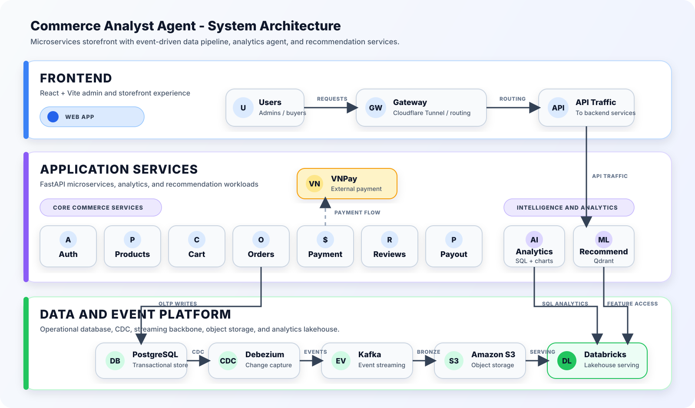
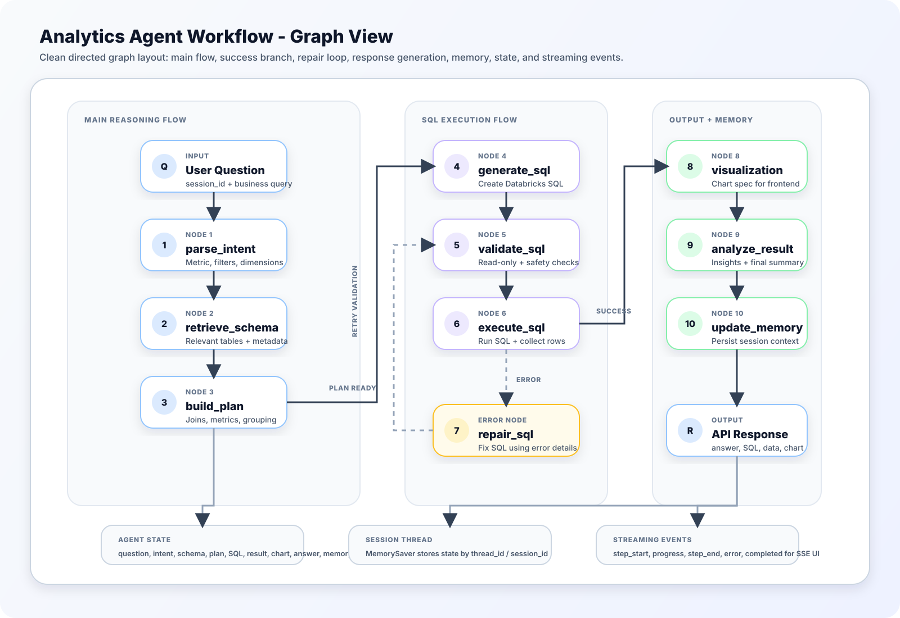

# Commerce Analyst Agent

Nền tảng eCommerce theo kiến trúc microservices, gồm storefront, gateway, các service nghiệp vụ, recommender, analytics agent, Kafka/CDC và Databricks/Qdrant integration.

## System Architecture



## Analytics Agent Workflow



## Yêu cầu

- Docker 20.10+
- Docker Compose v2+
- Git

## Thiết lập môi trường

1. Tạo file `.env` từ mẫu:

```bash
cp .env.example .env
```

2. Cập nhật các biến quan trọng trong `.env`:

- Postgres: `POSTGRES_USER`, `POSTGRES_PASSWORD`, `POSTGRES_DB`, `POSTGRES_PORT`
- Gateway/domain: `DOMAIN_NAME`, `GATEWAY_PORT`
- Recommender: `QDRANT_URL`, `QDRANT_API_KEY`, `BOOK_COLLECTION`, `USER_COLLECTION`
- Analytics agent: `GOOGLE_API_KEY`, Databricks settings
- S3/CDC: `AWS_ACCESS_KEY_ID`, `AWS_SECRET_ACCESS_KEY`, `S3_BUCKET_NAME`, `S3_REGION`
- VNPay và Cloudflared nếu bạn dùng các luồng đó

## Cấu trúc compose

Repo dùng 3 file compose chính trong thư mục [`compose`](./compose):

- [`infra.yml`](./compose/infra.yml): Postgres, Kafka, Kafka Connect, các hạ tầng chung
- [`app.yml`](./compose/app.yml): gateway, frontend và toàn bộ application services
- [`tools.yml`](./compose/tools.yml): công cụ hỗ trợ như Kafka UI

Ngoài ra còn có [`docker-compose.dev.yml`](./docker-compose.dev.yml) là file gộp legacy để chạy trực tiếp nếu cần.

## Cách chạy

### Phương pháp 1: helper scripts

- PowerShell: [`.\dev.ps1`](./dev.ps1)
- CMD: [`dev.cmd`](./dev.cmd)
- Shell: [`./dev.sh`](./dev.sh)

Trên Linux/macOS:

```bash
chmod +x dev.sh
```

### Các lệnh helper chung

| Hành động | PowerShell | CMD | Shell |
| --- | --- | --- | --- |
| Start infra + app | `.\dev.ps1 up` | `dev.cmd up` | `./dev.sh up` |
| Start infra + app + tools | `.\dev.ps1 up-tools` | `dev.cmd up-tools` | `./dev.sh up-tools` |
| Stop hệ thống | `.\dev.ps1 down` | `dev.cmd down` | `./dev.sh down` |
| Xem trạng thái | `.\dev.ps1 ps` | `dev.cmd ps` | `./dev.sh ps` |
| Xem log service | `.\dev.ps1 logs order_service` | `dev.cmd logs order_service` | `./dev.sh logs order_service` |
| Restart service | `.\dev.ps1 restart gateway` | `dev.cmd restart gateway` | `./dev.sh restart gateway` |
| Build images | `.\dev.ps1 build` | `dev.cmd build` | `./dev.sh build` |
| Validate compose | `.\dev.ps1 config` | `dev.cmd config` | `./dev.sh config` |

### Lệnh bổ sung hiện có trong PowerShell helper

[`dev.ps1`](./dev.ps1) hiện có thêm:

- `.\dev.ps1 up-build`: tương đương `docker compose ... up --build -d`
- `.\dev.ps1 down-volumes`: tương đương `docker compose ... down -v`

### Phương pháp 2: Docker Compose trực tiếp

Start infra + app:

```bash
docker compose --env-file .env -f compose/infra.yml -f compose/app.yml up -d
```

Build rồi start:

```bash
docker compose --env-file .env -f compose/infra.yml -f compose/app.yml up --build -d
```

Start kèm tools:

```bash
docker compose --env-file .env -f compose/infra.yml -f compose/app.yml -f compose/tools.yml up -d
```

Xem trạng thái:

```bash
docker compose --env-file .env -f compose/infra.yml -f compose/app.yml -f compose/tools.yml ps
```

Xem log:

```bash
docker compose --env-file .env -f compose/infra.yml -f compose/app.yml -f compose/tools.yml logs -f <service>
```

Restart service:

```bash
docker compose --env-file .env -f compose/infra.yml -f compose/app.yml restart <service>
```

Build images:

```bash
docker compose --env-file .env -f compose/infra.yml -f compose/app.yml build
```

Stop hệ thống:

```bash
docker compose --env-file .env -f compose/infra.yml -f compose/app.yml -f compose/tools.yml down
```

Stop và xóa volumes:

```bash
docker compose --env-file .env -f compose/infra.yml -f compose/app.yml -f compose/tools.yml down -v
```

## Ghi chú vận hành

- Frontend chạy bằng Vite trong container `commerce-frontend`.
- Frontend dùng script [`frontend/scripts/dev-entrypoint.sh`](./frontend/scripts/dev-entrypoint.sh) để tự đồng bộ dependencies khi `package-lock.json` thay đổi. Nếu bạn thêm package mới, lần recreate kế tiếp của frontend sẽ tự `npm ci`.
- Gateway build từ template [`gateway/templastes/default.conf.template`](./gateway/templastes/default.conf.template), không dùng `gateway/nginx.conf` làm nguồn chạy chính trong stack compose hiện tại.

## Tính năng nổi bật hiện có

- Storefront và luồng mua hàng nhiều service
- Recommender service qua Qdrant + enrichment dữ liệu sách
- Analytics agent qua SSE stream
- Analytics chat admin có thể trả:
  - `final_answer`
  - `validated_sql`
  - `query_result`
  - `visualization` để frontend render chart inline

## Danh sách service và endpoint local

| Service | Local endpoint | Port | Ghi chú |
| --- | --- | --- | --- |
| Gateway | http://localhost/health | `80` | entrypoint chung cho API |
| Frontend | http://localhost:5175 | `5175` | React/Vite app |
| Auth service | http://localhost:8000/health | `8000` | auth và user |
| Product service | http://localhost:8001/books?page=1&page_size=1 | `8001` | book catalog |
| Cart service | http://localhost:8002/health | `8002` | cart |
| Order service | http://localhost:8003/health | `8003` | orders |
| Payment service | http://localhost:8004/health | `8004` | payments |
| Review service | http://localhost:8006/health | `8006` | reviews |
| Analytics agent | http://localhost:8007/health | `8007` | AI analytics API |
| Payout service | http://localhost:8008/health | `8008` | payout requests |
| Recommender service | http://localhost:8009/health | `8009` | recommendations |
| Kafka UI | http://localhost:8080 | `8080` | chỉ có khi chạy tools |
| Postgres | `localhost:5433` | `5433` | DB host port mặc định theo `.env.example` |

## Seed dữ liệu

- Dữ liệu mẫu nằm trong [`dev-seeds.json`](./dev-seeds.json)
- Nhiều service dùng `DEV_AUTO_SEED=true` và `DEV_SEED_FILE` để seed dữ liệu khi database còn trống
- Kafka Connect tự đăng ký connector sau khi hạ tầng và backend ổn định

## Dọn dẹp

Dừng stack:

```bash
docker compose --env-file .env -f compose/infra.yml -f compose/app.yml -f compose/tools.yml down
```

Dừng và xóa volumes:

```bash
docker compose --env-file .env -f compose/infra.yml -f compose/app.yml -f compose/tools.yml down -v
```

`down -v` sẽ xóa toàn bộ dữ liệu local trong volume Postgres và Kafka.
